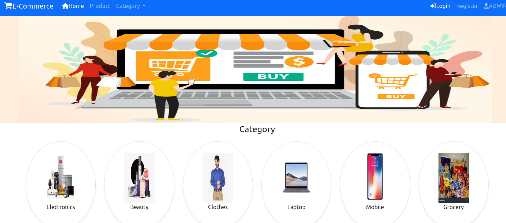

# Spring Projects

This repository contains multiple Spring-based projects showcasing different aspects of Java-based development. From CRUD applications to more complex systems like **eCommerce** and **Employee Management**, these projects demonstrate best practices in backend development, frontend integration, and security implementation.

## Projects Overview

- **CRUD Application**: A basic project demonstrating Create, Read, Update, and Delete operations using Spring Boot.
- **eCommerce Platform**: A full-fledged eCommerce system to manage products, orders, and users.
- **Employee Management System**: A project for managing employee data with features like role-based access and CRUD operations.
- **User Management**: Handling user authentication, registration, and profile management with security features.


## Tech Stack

This repository leverages a robust stack of technologies to build secure and efficient applications:

- **Backend**:
  - **Spring Boot**: Framework for creating stand-alone, production-grade Spring-based applications.
  - **Spring Security**: Provides authentication, authorization, and secure access control.
  - **Spring REST**: For creating RESTful web services to facilitate communication between frontend and backend.
  - **SPI (Service Provider Interface)**: Used for creating pluggable components and enhancing application extensibility.
  
- **Frontend**:
  - **HTML**: Structuring content for web pages.
  - **CSS**: Styling the web pages to make them visually appealing and responsive.
  - **JavaScript**: Adds interactivity to the web pages.
  - **Bootstrap**: A powerful front-end framework for building responsive and mobile-first websites.
  
- **Other Technologies**:
  - **Java**: The core language for backend development.
  - **MySQL/PostgreSQL**: Relational databases used to store application data.
  - **JPA (Java Persistence API)**: For database interaction and object-relational mapping (ORM).
  - **Thymeleaf**: A modern server-side Java template engine used for rendering web pages.

## Features


- Secure user authentication and authorization with **Spring Security**.
- Flexible and responsive **UI** built with **Bootstrap**.
- **REST API** endpoints for easy integration with frontend technologies.
- Modular and extensible design using **SPI** for adding future features.
- **CRUD operations** to manage entities such as employees, users, and products.
  
## Setup and Installation

To run this project locally, follow the steps below:

1. Clone the repository:
   ```bash
   git clone https://github.com/PranjalKumar09/spring_projects.git
   ```

2. Navigate into the project directory:
   ```bash
   cd spring_projects
   ```

3. Build the application using Maven or Gradle:
   - **Maven**:
     ```bash
     ./mvnw clean install
     ```
   - **Gradle**:
     ```bash
     ./gradlew build
     ```

4. Run the Spring Boot application:
   ```bash
   ./mvnw spring-boot:run
   ```

   The application will be accessible at `http://localhost:8080`.

## Contribution

Feel free to fork this repository and submit pull requests. Contributions are welcome for bug fixes, features, and improvements.

## License

This project is licensed under the Apache License - see the [LICENSE](LICENSE) file for details.

---